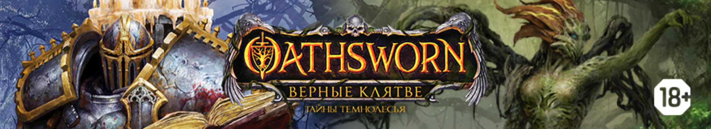

# Oathsworn-RAG
### Это репозиторий для выпускного проекта по курсу Otus NLP. Чат-бот для ответов на вопросы по правилам настольной игры Oathsworn: Верные клятве. 
Развернуть векторную БД в Qdrant
```
docker run -p 6333:6333 qdrant/qdrant
```
Инициализация БД и загрузка векторов правил
```
python init_db.py
```
Запуск чат-бота
```
python bot.py
```
